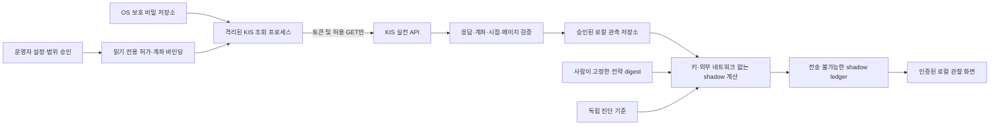

# KIS Production Read-Only and Shadow Observation

- Date: 2026-10-02
- Status: PROPOSED - PLAN ONLY; IMPLEMENTATION AND EXTERNAL EXECUTION NOT AUTHORIZED BY THIS DOCUMENT
- Owner: operator
- Related: [master plan](ats-master-plan.md), [live development plan](live-autotrading-plan.md),
  [ADR 0003](../adr/0003-bounded-automatic-live-trading.md), [ADR 0004](../adr/0004-paper-trial-authorization.md),
  [current RSI evidence](rsi-development-plan.md#current-verification-and-boundaries)

## Objective

본인 한국투자증권 실전 계좌와 시세를 **조회만** 하고, 동일 시점의 자료로 전략이 제안할 행동과
위험 검사 결과를 관찰합니다. 계좌에 주문·취소·정정·이체를 보내지 않으며 실제 보유를 변경하지 않습니다.
이번 요청은 계획 작성입니다. 비밀 조회·토큰 발급·실제 계좌/시세 조회·반복 수집·저장·배포를 실행하지 않습니다.

첫 관찰은 실제 계좌에 대한 일회성 반사실적 진단인 `ACTUAL_ACCOUNT_OVERLAY`를 권장합니다.
가상 주문이 체결됐다고 가정해 다음 날 실제 잔고에 더하지 않습니다. 독립적인 가상 포트폴리오는
추후 별도 ledger·자금·체결 모델로 설계하고 실제 계좌 화면과 혼합하지 않습니다.

완료 산출물은 보호된 조회 연결, 검증된 계좌 관측, 전송 불가능한 shadow 기록, 인증된 로컬 상태 화면,
일일 관찰 보고서입니다. 수익성 인증·실제 paper 세션·승격·실거래 활성화는 산출물이 아닙니다.

## Current Baseline

| 현재 근거 | 재사용 범위 | 새로 필요한 부분 |
| --- | --- | --- |
| [실전 시세 전용 클라이언트](../../src/ats/data/kis.py)와 사용자 단발 조회 성공 기록 | 고정 origin·토큰 만료·rate limit·비밀 안전 오류·일별 시세 처리 | 현재 키 유효성은 미확인; 일반 수집/보관 승인 및 실전 계좌 조회 없음 |
| [모의 어댑터](../../src/ats/kis_paper.py)의 계좌·주문 장부 오프라인 검증 | 필드 검증·페이지 일관성·미확정 상태의 실패 패턴 참고 | 상속/URL 변경으로 실전 전환하지 않음; 모의 필드 등식이 실전에서도 맞는지 별도 검증 |
| [독립 위험 계산](../../src/ats/risk/assessor.py)과 paper 전용 계약 | 현금·보유·신선도·중복·노출·손실 검사의 계산 원칙 | shadow 전용 결과 계약; 미검증 계좌 상태나 champion 선택을 만들어내지 않음 |
| RSI·보존·서명·운영 UI의 합성 검증 | 불변 artifact, 삭제/만료 guard, 역할·감사·중단·재개·상태 표시 | 실제 자료의 권리·운영 신원·비밀 없는 실행 이미지·실제 조회 검증 |

기존 `shadow_risk`는 paper `OrderIntent`와 champion 검사를 그대로 실행하는 비전송 진단입니다.
실전 계좌를 이 계약에 모의계좌인 것처럼 넣지 않습니다. 새 실전 shadow에는 별도의 관측·제안 계약이 필요합니다.
앞선 698개 테스트는 합성/로컬 실행의 특정 시점 근거이며 이 계획의 실전 조회 검증을 대체하지 않습니다.

## Non-Negotiable Boundaries

1. 기본은 DISARMED입니다. 유효한 조회 허가·계좌 바인딩·소스 정책이 없으면 비밀을 로드하지 않습니다.
2. production 조회 클라이언트는 paper 주문 클라이언트를 상속하지 않으며 주문 모듈을 import하지 않습니다.
   전략이나 화면이 URL·HTTP method·TR ID·계좌번호·조회 범위를 임의 지정할 수 없습니다.
3. 인증용 POST는 `/oauth2/tokenP`만 예외입니다. 데이터 요청은 검토된 GET 목록만 허용합니다.
   주문·정정·취소·이체·임의 proxy·redirect·WebSocket은 이 범위에서 제공하지 않습니다.
4. App Key 자체가 증권사 차원의 조회 전용 권한이라고 가정하지 않습니다. 제한은 이 프로그램의
   기능·검증된 실행물·프로세스 경계에 의존합니다. 키를 읽을 수 있는 악성 프로세스나 관리자까지
   무력화하는 보장은 하지 않으며 운영 PC와 키 보관 경계도 보호해야 합니다.
5. 현금만 사용, 국내 일반 주식/일반 ETF, 장 마감 판단/다음 승인 세션 관찰을 유지합니다.
   종목 10%·일일 손실 1%·낙폭 15%를 완화하지 않습니다. 별도 고정 투자금이나 일일 매수/주문 건수
   상한을 다시 요구하지 않습니다. 여기서 제안하는 HTTP 호출 예산은 거래 한도와 다른 자원 제한입니다.
6. 관찰 후보는 사람이 digest로 고정합니다. 후보 선택은 승격이 아니며 미승인 champion 상태는 그대로입니다.
   RSI가 실행 중인 관찰 후보·위험 정책·조회 허가를 자동으로 바꾸지 못합니다.
7. shadow는 `broker_orders_sent=0`, `execution_authorized=false`, `actual_paper_sessions=0`입니다.
   기존 paper/live 종료 조건과 최소 20개 실제 paper 세션을 면제하지 않습니다.
8. 실제 자료를 기존 공개 합성 사이트, 외부 AI, 채팅, Git, CI artifact에 보내지 않습니다.
   수집 화면 공개·배포·OS 예약 등록·실제 자격증명 생성/교체는 별도 승인 대상입니다.

## Architecture

- 비밀은 조회 프로세스만 읽습니다. 연구 container에 계좌 원문·키 저장 경로를 mount하지 않습니다.
- 실전 조회/시장 조회가 같은 APP을 쓰면 토큰·호출 예산은 한 프로세스에서 공유합니다.
  기존 시세 클라이언트의 공개 API를 유지하며 필요한 내부 인증 코드 공유는 집중 회귀 후에만 적용합니다.
- shadow에 필요한 최소 계좌 필드만 전달합니다. 실제 계좌번호·APP 식별자는 로컬 alias와
  보호된 매핑으로 분리합니다. 번호의 단순 hash를 익명화 수단으로 믿지 않습니다.
- 계좌/시세 수신 시각, 서버 기준일, 페이지 시작·종료 시각, 관측 완료 시각을 각각 기록합니다.
  REST 조회 여러 개를 원자적 계좌 snapshot으로 부르지 않으며 허용 시간차와 재대사 조건을 둡니다.

## API Boundary

production origin은 `https://openapi.koreainvestment.com:9443`으로 고정합니다.
아래는 구현 검토 대상이며 아직 허용 목록을 활성화한 것이 아닙니다. 각 경로의 production TR ID,
필수 인자, 연속조회, 응답 필드 의미와 지원 범위는 S1에서 공식 문서·고정 샘플 commit으로 확정합니다.
모의 TR ID의 접두어를 바꾸어 production 규약이라고 가정하지 않습니다.

| 용도 | 검토할 정확한 경로 | 조건 |
| --- | --- | --- |
| 개인 인증 | POST `/oauth2/tokenP` | client credentials, 만료·발급 제한 준수; 알림톡이 발생할 수 있음 |
| 잔고·보유·평가 | GET `/uapi/domestic-stock/v1/trading/inquire-balance` | 고정 계좌, 페이지 완료·중복·계좌 동일성·합계 대조 |
| 종목/가격별 현금 주문 가능량 조회 | GET `/uapi/domestic-stock/v1/trading/inquire-psbl-order` | 조회만 수행; 실제 종목·지정 가격에 맞는 현금전용 필드 검증 |
| 주문·체결 이력 조회 | GET `/uapi/domestic-stock/v1/trading/inquire-daily-ccld` | 승인된 짧은 날짜 범위; 수동 주문도 외부 활동으로 기록 |
| 미체결/정정취소 가능 주문 조회 | GET `/uapi/domestic-stock/v1/trading/inquire-psbl-rvsecncl` | **조회**만; 이 응답이 전체 미체결을 완전히 포함하는지 대조 전까지 예약 계산 근거로 단독 사용 금지 |
| 현재가 | GET `/uapi/domestic-stock/v1/quotations/inquire-price` | 종목·시장 구분 고정, 시각·장 상태 검증 |
| 일별 가격 | 기존 GET `/uapi/domestic-stock/v1/quotations/inquire-daily-itemchartprice` | 실제 반복 수집/보관 승인, 관측 시점 보존, 제공 범위·페이지 한계 준수 |

브로커에 대해 위 목록 외 요청, 특히 `order-cash`, `order-rvsecncl`, 이체 계열은 모두 차단합니다.
로컬 화면의 인증·중단 POST와 브로커에 보내는 POST는 별개의 경계입니다.
API 경로가 `trading` 아래 있다는 이유만으로 주문이라고 해석하거나, GET이라는 이유로 모든 경로를 허용하지 않습니다.

## Credentials and Rights

| 항목 | 제안 | 사용자 확인 |
| --- | --- | --- |
| 실전 APP | 기존 키가 유효하면 재사용 가능; 자동 재발급/회전 없음 | 발급 여부만 알리고 값은 채팅에 보내지 않음 |
| 비밀 저장 | Windows 사용자 단위 OS 보호 저장소, 코드에는 credential slot만 기록 | 사용자가 보호된 로컬 입력 경로에 직접 입력; 실제 저장 방식 검증 후 사용 |
| 계좌 | alias와 8자리 계좌·2자리 상품코드의 보호된 매핑 | 본인 계좌·상품코드·신용/미수 설정 확인, 전체 번호는 문서에 기록하지 않음 |
| token | 메모리 캐시·응답 절대 만료 우선, 안전 여유·발급 cooldown·single-flight | 최초 인증 알림 발생 가능성 확인; 재시작 시 무제한 발급 금지 |
| 자료 이용 | 개인 연구·관찰의 허용 범위와 기간을 source policy에 기록 | 시세·계좌·원문·파생물 보관 기간과 사용 조건 확인 |
| 신원 | 실제 조회 화면은 운영자 allowlist·검증된 인증 필요 | 실제 승인자/발급자 설정; 합성 fixture token으로 실제 계좌 자료를 열지 않음 |

`.env`, shell history, 명령 인수, 예외 traceback, HTTP wire log, crash dump, 테스트 fixture에
실제 키를 남기지 않습니다. 비밀 존재 여부 검사도 값 출력 없이 구현하고 승인 전 실행하지 않습니다.
저장소 밖이라는 사실만으로 평문 파일이 안전해지는 것은 아닙니다. 백업·권한·삭제 범위를 함께 검증합니다.
보관 승인 전 S3 smoke는 메모리에서만 처리하고, 비식별 결과 요약도 승인된 필드만 남깁니다.
자료 원문을 보관할 수 없으면 해당 자료의 재현 가능성을 주장하지 않습니다.

## Data and Shadow Contracts

신규 타입·파일명은 구현 제안입니다. 아래 링크된 기존 모듈 외의 새 파일은 아직 없습니다.

- `ReadOnlyAccessPermit`: operator, account alias, credential reference, 정확한 route/scope,
  조회/보관 허가 digest, 시작·만료 시각, rate/페이지/바이트/총호출 예산, 최대 snapshot 시간차,
  관찰 기간과 중단 상태. 조회 허가와 거래 권한을 연결하는 필드는 두지 않습니다.
- `ProductionAccountObservation`: 환경·계좌 alias·관측 시각·보유/매도가능 수량·예수금·현금 가능액·
  미결제/미수/신용 구분·미체결 예약·평가액·외부 자금흐름·근거/완전성/만료. 필드 미지원은 UNKNOWN입니다.
- `ShadowProposal`: 후보/코드/정책/입력 digest, 판단 시각, 관찰 대상 세션, 종목, 방향, 제안 가격·수량,
  근거, 후보의 연구 게이트 상태, `transmittable=false`. `OrderIntent`나 실제 주문의 하위 타입으로 만들지 않습니다.
- `ShadowAssessment`: 검사별 `PASS`/`BLOCKED`/`UNKNOWN`, 관측 일관성, 일일손실/낙폭의 기준 유효성,
  제안 결과와 거절 사유. 일부 수치 PASS가 전체 `ALLOW`나 주문 승인으로 보이지 않게 합니다.
- `ShadowSessionReport`: 실행·누락·오류/중단·호출 통계, 전략 변경 없음, 제안/검사 요약,
  추후 관측 가격, 읽기 전용 transport audit digest와 브로커 주문 요청 0. 실제 체결 P&L·paper 실적으로 표시하지 않습니다.

### Accounting Rules

1. 예수금, 주문가능현금, D+1/D+2 예상금, 미결제 매도대금, 신용을 포함할 수 있는 매수가능금액을 분리합니다.
   모의 어댑터의 `cash + holdings == equity` 등식을 실전 응답에 그대로 강제하거나 총평가액으로 현금을 추정하지 않습니다.
2. `ord_psbl_cash`/`nrcvb_buy_amt` 등의 의미·포함 범위를 공식 규약으로 확인한 뒤 매핑합니다.
   보수적 최솟값도 의미가 검증된 값끼리만 사용합니다. 예약 반영 금액과 미체결 예약을 이중 차감하지 않습니다.
3. 전 계좌의 보유·미체결은 노출에 포함합니다. 전략 소유가 불명확한 보유분에 가상의 매도 권한을 부여하지 않습니다.
4. 페이지 간 잔고 변화·다른 계좌·금액 불일치·알 수 없는 주문 상태는 불완전 관측으로 거절합니다.
   필요한 경우 bounded 재조회하되 일관성을 얻지 못하면 세션을 실패로 남깁니다.
5. 수동 거래·입출금·배당·기업행동은 외부 사건입니다. 현금 변화만으로 투자 수익이라고 계산하지 않습니다.
   일중 시작/고점·자금흐름이 미확보이면 손실/낙폭 검사는 UNKNOWN으로 표시하고 0%로 채우지 않습니다.
6. 실제 미체결과 가상 제안을 구분하고 shadow를 실제 예약 장부에 쓰지 않습니다.
   overlay에서 동시 제안을 평가할 때는 같은 cash snapshot을 중복 할당하지 않게 가상 예약을 세션 안에서만 계산합니다.
7. 독립 가상 포트폴리오를 별도 승인하기 전에는 가상 체결·수익률을 누적하지 않습니다.
   다음날 가격 움직임은 참고 관측이며 실제 체결·슬리피지·수익을 입증하지 않습니다.

## Implementation Stages

| 단계 | 작업·산출물 | 통과 기준 | 실행 경계 |
| --- | --- | --- | --- |
| S0 | 계획·위협 모델·허가 항목·실행 환경 합의 | 계좌 소유·범위·비밀 저장·자료 권리·신원 미정 항목 표시 | 이번 요청은 문서만; 아래 구현은 계획 승인 후 |
| S1 | production 읽기 전용 adapter·API/필드표·허가 검사·공유 token/rate 관리 | 고정 origin/method/route/TR, 미승인 시 비밀 접근/HTTP 0, 주문 경로 전부 거절 | 합성 입력/공식 기술 문서만 |
| S2 | 계좌 관측·비전송 shadow 계약·ledger·UI·중단/복구 | 아래 음성 테스트와 paper 계약 회귀 통과; UI에 합성/실관측/제안/UNKNOWN 구분 | 합성 시험만; 운영 신원 구성이나 실제 자격증명 읽기 없음 |
| S3 | 사용자가 허가한 단발 실전 조회 smoke | 토큰·고정 계좌 조회·완전성 확인, 비밀/계좌번호 노출 0, 주문·취소·정정·이체 요청 0 | 별도 일회 조회 승인; 기본 원문 보관 없음; 사용자가 로컬에서 실행 |
| S4 | 기간 제한 shadow 관찰·일일 보고·중단/재개 | 사전 승인된 기간/횟수 안에서 실행, 최신 근거·지연 표시·비전송 감사, 장애 후 자동 활성화 없음 | 별도 반복 조회·보관·로컬 서비스 실행 승인 |
| S5 | 관찰 결과 검토·잔여 위험·다음 결정 기록 | 수행/미수행 세션·UNKNOWN·조회 실패·비밀 유출 여부를 구분; 권한은 만료 후 닫힘 | 실주문·paper 전환·승격·클라우드 배포 없음 |

S1과 S2는 구현 승인 한 번으로 합성 검사까지 연속 진행할 수 있습니다. 실제 연결 S3와 반복 관찰 S4는
서로 다른 승인입니다. 단계 종료는 완료 증거로 판단하며 사용자 승인/외부 증거 없이 달력 시간만으로 넘기지 않습니다.

### Proposed Operating Values

아래는 새 계획의 **제안값**이며 현재 정책에 적용하지 않습니다. 최종 값은 S0/S1에서 공식 한도와
허용 범위를 확인해 버전 고정합니다. 과거 단발 smoke의 1분당 1회 제한을 새 범위에 자동 확대하지 않습니다.

- 첫 환경: 본인 로컬 Windows, 계좌 alias 1개, read-only 프로세스 1개. 클라우드/외부 접속 제외.
- S3: 토큰 요청 최대 1회, 각 필수 조회의 완결된 묶음 1회. 호출 경로·최대 페이지를 합산한
  총 예산을 실행 전에 출력하고 승인 범위를 넘지 않음. 전체 REST 데이터 요청 상한 제안 60회.
- 호출 속도: 공식 계정 한도와 승인 rate 중 더 엄격한 값. 과도한 병렬 조회 금지, 모든 페이지/재시도도 예산에 포함.
- 연결/응답 timeout 제안 10초, 전체 회차 wall-clock 예산 제안 120초, 페이지 상한 제안 20.
  supervisor가 hard deadline을 제어하며 HTTP read timeout만으로 전체 제한을 보장한다고 하지 않음.
- 데이터 GET 재시도: 일시적인 통신/429/일부 5xx만 최대 2회, 제한된 backoff; 인증/계좌 불일치/필드 오류는 즉시 중단.
  임의 신규 token 반복 발급이나 다른 origin·계좌·환경으로 fallback하지 않음.
- 자료 최대 나이 제안: 관찰 시 현재가·계좌 관측 각각 60초, 구성요소 간 수신 시간차 30초.
  장중/장외와 달력에 맞게 검증하고 호출 제한 때문에 충족할 수 없으면 UNKNOWN, 기준을 자동 완화하지 않음.
- S4 첫 기간 제안: 실제 KRX 거래일 5개. 이는 기능 관찰 구간일 뿐 통계 검증 또는 20 paper 세션의 대체가 아님.
  일부 기능 실패 시 통과한 날만 골라 완료 처리하지 않고 실패·재시작을 함께 보고.
- 보관 기간은 제안으로 확정하지 않음. source/원문/계좌 관측/파생 보고서/백업별 사용자 권리 확인 전 지속 저장 금지.

### Daily Observation

1. 장 마감 이후 승인된 완료 일봉·공시 snapshot을 고정하고 다음 실제 거래 세션을 확인합니다.
   조회 시각을 과거 발표/거래 시각으로 소급하지 않습니다.
2. 사람이 고정한 후보가 같은 snapshot으로 `ShadowProposal`을 작성합니다. champion pointer는 그대로입니다.
   검증에서 거절된 후보도 관찰할 수 있으나 RESEARCH_ONLY/미승격을 표시하고 신호를 승인으로 바꾸지 않습니다.
3. 다음 승인된 장 시작 관찰 구간에 최신 시세·현금·보유·미체결을 조회합니다. 개장 시간/휴장은
   검증된 달력이 없으면 추정하지 않고 관찰을 보류합니다. 장중 반복 매매 전략으로 확대하지 않습니다.
4. 독립 진단이 검사별 결과·가상 수량·누락 근거를 기록합니다. 1주가 10% 한도 안에 들어오지 않으면
   제안 수량 0이며 최소 주문을 위해 위험 기준을 완화하지 않습니다.
5. 가상 주문은 전송하지 않습니다. 일일 보고서에는 관측 품질·제안·진단·외부 수동 활동·오류만 기록합니다.

## Test and Exit Evidence

| 검증 | 실패를 판별하는 테스트/증거 |
| --- | --- |
| 전송 경계 | 주문/취소/정정/이체 및 임의 GET/POST, route 우회·다른 origin/TR·redirect·계좌 바꿔치기를 credential/HTTP 이전에 거절 |
| 비밀 | 실제 키 없이 fixture로 로그·오류·report·UI·URL에 secret 유출 0, 허가 없는 credential provider 호출 0, 연구 프로세스 접근 0 |
| 인증/호출 | 재사용 token 절대 만료, 동시 발급 single-flight, 401/403/429, 페이지 루프·예산/기한 초과, 중단 뒤 신규 요청 0 |
| 계좌 | 페이지 간 변동, 중복 종목, 계좌 불일치, 현금/신용/미결제 구분 미확인, 미체결 누락 시 UNKNOWN/중단; 가능한 경우 사용자 MTS 값과 같은 기준으로 대조 |
| 시점·시장 | 지연/누락/휴장/기업행동/미확인 종목·결정 후 알려진 분류를 거절하고 마지막 성공값을 현재값으로 대체하지 않음 |
| shadow 경계 | 후보가 champion으로 바뀌지 않음, `ShadowProposal`을 paper/live dispatcher에 넣을 수 없음, 실제 예약/보유에 가상 결과 미반영 |
| 회계 | 입출금으로 손실 초기화 금지, 외부 수동 거래·배당 분리, 같은 현금 중복 가상 할당 금지, 기초 가치 미확보 시 UNKNOWN |
| 복구 | 읽기 작업 lease·중복 session 방지, 프로세스 강제 종료 후 상태 복구, permit 만료/철회·키 오류 후 수동 확인 전 재시작 거절 |
| UI | 실제 신원 없는 접근 거절, VIEWER 변경 금지, 자료와 생성 시각·만료·관찰 후보·미승격 표시, 로그아웃/만료 시 계좌 자료 제거, desktop/mobile 확인 |
| 회귀 | 변경 slice 집중 검사 후 전체 lint/format/type/test/lock/schema; 기존 paper 주문·위험·승인 계약 변경 없음 |

실제 S3/S4에서는 비밀을 노출하지 않는 transport audit로 허용된 인증/조회 수를 기록하고 브로커
주문 mutation 요청은 0임을 확인합니다. 계좌 거래내역이 비어 있다는 사실만으로 프로그램 무전송을 입증하지 않습니다.
사용자 수동 거래는 프로그램이 만든 체결로 표시하지 않습니다.
S4 성공은 연결·관측·보호 장치의 증거일 뿐 전략의 기대수익·실제 체결·실전 주문 준비의 증거가 아닙니다.

## Proposed Work Items

아래 경로는 구현할 때의 제안이며 이번에는 생성하지 않습니다.

| 대상 | 변경 계획 |
| --- | --- |
| 기존 `src/ats/data/kis.py` | 시세 전용 공개 경계 유지; 필요한 인증/rate 협력만 회귀로 보호 |
| 신규 `src/ats/kis_readonly.py` | production 조회 전용 조합형 클라이언트, 허가·계좌 바인딩, 보호된 credential provider |
| 신규 `src/ats/shadow.py` | 관측/제안/진단/session 계약, 실제 계좌 overlay, 전송 없는 실행과 멱등 ledger |
| 기존 `src/ats/risk/assessor.py` | paper 규칙을 그대로 유지; 필요 시 수치 계산만 별도 순수 함수로 추출하고 동일 결과 회귀. champion 거짓 통과 분기 금지 |
| 기존 운영 API/UI | 합성/실관측을 별도 entrypoint로 분리; 실제 화면에는 fixture 인증 경로 없음; 조회 중단/관찰 상태만 제공 |
| 신규 DRAFT 설정·기존 테스트 | read-only 허가 template, 합성 권한/보안/회계/장애 테스트, 필요한 contract/schema 검사 |
| 문서 | 실제 field mapping·운영자 직접 입력/단발 실행·중단/복구 안내, 수행 결과와 제한 기록 |

## Operator Decisions

지금은 아래 **비밀이 아닌 결정**만 필요합니다. 계좌번호·키 값·잔고 상세는 채팅으로 요청하지 않습니다.

| 결정 | 권장 선택 | 승인 의미 |
| --- | --- | --- |
| 이 계획의 S1-S2 구현 | 로컬 구현·합성 테스트만 승인 | 실제 API/자격증명 접근은 여전히 금지 |
| 실행 장소 | 본인 로컬 Windows부터 | 배포·상시 실행·OS 등록 승인 아님 |
| 관찰 방식 | 실제 계좌 overlay | 별도 가상 portfolio/체결/수익 누적은 제외 |
| 자료 이용·보존 | 허용된 scope·기간과 보관 기한을 사용자가 확인 | 미정이면 실제 지속 수집·저장 불가 |
| S3 조회 승인 | 개발/음성 검사 통과 후 별도 일회 승인 | 고정 계좌 인증/명시적 GET만; 주문 없음 |
| S4 관찰 승인 | S3 성공 후 제안 5거래일과 시간대·종료일을 확정 | 반복 조회·승인된 로컬 보관만; 자동 갱신 없음 |

S1-S2 승인 예시: "이 계획에 따라 실전 조회 전용과 shadow의 로컬 구현·합성 테스트만 승인합니다.
실제 키 접근, 토큰 발급, 계좌/시세 조회, 저장, 주문, 배포는 별도 승인 전까지 금지합니다."
이 문구는 사용자가 명시적으로 선택할 수 있는 예시이지 이미 받은 승인 기록이 아닙니다.

현재 실전 APP의 유효성·실전 계좌 권한은 확인하지 않았습니다. 개발 완료 후 사용자가 보호된
로컬 입력 및 조회 smoke를 직접 수행하도록 안내합니다. 토큰·APP Secret을 채팅으로 전달하거나
에이전트가 대신 실제 금융거래를 실행하는 경로는 이 계획에 없습니다.

## References

- [KIS 서비스 이용 안내](https://apiportal.koreainvestment.com/about-howto)
- [KIS 개인 인증·시세 이용 범위](https://apiportal.koreainvestment.com/about-open-api)
- [공식 API 샘플 저장소](https://github.com/koreainvestment/open-trading-api)
- [기존 KIS 시세 권리·단발 조회 근거](../sources/kis-market-data.md)

공식 샘플 전체 실행은 주문 코드를 포함할 수 있으므로 이 프로젝트의 read-only 시험으로 사용하지 않습니다.
API 규약 확인은 S1에서 범위를 좁혀 재검증하며, 이 계획 작성으로 실제 연결·정책·과거 승인 기록을 변경하지 않습니다.
